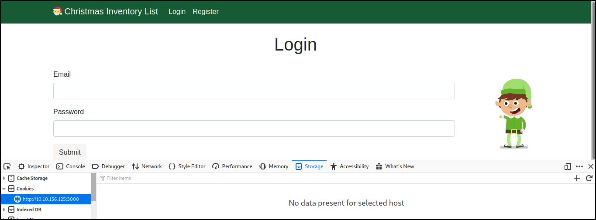

# Advent of Cyber - Christmas 2019 Writeup

# Table of Contents
1. [Day 1 - Inventory Management](#day1)
2. [Day 2 - Artic Forum](#day2)
3. [Day 3 - Evil Elf](#day3)
4. [Day 4 - Training](#day4)
5. [Day 5 - Ho-Ho-Hosint](#day5)
6. [Day 6 - Data Elf-iltration](#day6)
7. [Day 7 - Skilling up](#day7)
8. [Day 8 - SUID Shenanigans](#day8)
9. [Day 9 - Requests](#day9)
10. [Day 10 - Metasploit-a-ho-ho-ho](#day10)
11. [Day 11 - Elf Applications](#day11)
12. [Day 12 - Elfcryption](#day12)
13. [Day 13 - Accumulate](#day13)
14. [Day 14 - Unknown Storage](#day14)
15. [Day 15 - LFI](#day15)
16. [Day 16 - File Confusion](#day16)
17. [Day 17 - Hydra-ha-ha-haa](#day17)
18. [Day 18 - ELF JS](#day18)
19. [Day 19 - Commands](#day19)
20. [Day 20 - Cronjob Privilege Escalation](#day20)
21. [Day 21 - Reverse Elf-ineering](#day21)
22. [Day 22 - If Santa, Then Christmas](#day22)
23. [Day 23 - LapLANd(SQL Injection)](#day23)
24. [Day 24 - Elf Stalk](#day24)

## Day 1 - Inventory Management <a name="day1"></a>

The first challenge is related to Web Hacking. Acording to the suplemental material cookies are generated every time an user perform an action, sent to the server and then checked if the user is authorized to do a certain action. Attackers can take advantange of cookies when these have not enough randomness. Cookie fixation or predictable cookie values are the main causes of taking control of user accounts. 

In order to access you need to navigate to the URL (http://<your-ip-address>:3000), here you can see a login page that requires for an user and password. However when you inspect in the Storage tab there is no cookie, this occurs because there is no user logged in yet. 
  


Let's create an account and login, now we can see a cookie of value `dGVzdHY0ZXI5bGwxIXNz`. In the lecture also mention that normally are base64 encoded 

```
root@kali:/home/kali# echo "dGVzdHY0ZXI5bGwxIXNz" | base64 -d
root@kali:/home/kali# testv4er9ll1!ss
```
  

### 1. What is the name of the cookie used for authentication?

`aut***`

### 2. If you decode the cookie, what is the value of the fixed part of the cookie?**

`v4*******ss`

### 3. After accessing his account, what did the user mcinventory request?**

`fi****ll`

## Day 2 - Artic Forum <a name="day2"></a>

## Day 3 - Evil Elf <a name="day3"></a>

## Day 4 - Training <a name="day4"></a>

## Day 5 - Ho-Ho-Hosint <a name="day5"></a>

## Day 6 - Data Elf-iltration <a name="day6"></a>

## Day 7 - Skilling up <a name="day7"></a>

## Day 8 - SUID Shenanigans <a name="day8"></a>

## Day 9 - Requests <a name="day9"></a>

## Day 10 - Metasploit-a-ho-ho-ho <a name="day10"></a>

## Day 11 - Elf Applications <a name="day11"></a>

## Day 12 - Elfcryption <a name="day12"></a>

## Day 13 - Accumulate <a name="day13"></a>

## Day 14 - Unknown Storage <a name="day14"></a>

## Day 15 - LFI <a name="day15"></a>

## Day 16 - File Confusion <a name="day16"></a>

## Day 17 - Hydra-ha-ha-haa <a name="day17"></a>

## Day 18 - ELF JS <a name="day18"></a>

## Day 19 - Commands <a name="day19"></a>

## Day 20 - Cronjob Privilege Escalation <a name="day20"></a>

## Day 21 - Reverse Elf-ineering <a name="day21"></a> 

## Day 22 - If Santa, Then Christmas <a name="day22"></a>

## Day 23 - LapLANd(SQL Injection) <a name="day23"></a>

## Day 24 - Elf Stalk <a name="day24"></a>
