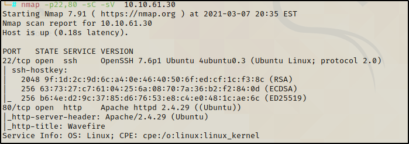
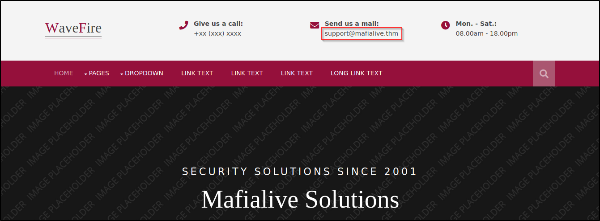
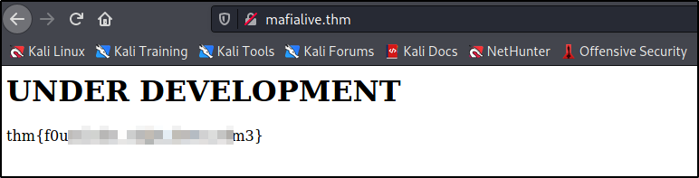

# Archangel TryHackme Walkthrough

<p align="center">
  
</p>

We begin with an nmap scan in two phases. First phase identify all ports open and then the second scan is used to identify the versions of those ports.

`nmap -p- -T4 -Pn -n --min-rate=5000 -oG Allports 10.10.179.65`


Ports 22 and 80 are open, now its time to scan versions `nmap -p22,80 -sC -sV 10.10.179.65`



Open a browser and look what is shown and we can see a standard website however there is a different hostname for support contact. Let's add this hostname in `/etc/hosts`



```
127.0.0.1       localhost
127.0.1.1       kali

# The following lines are desirable for IPv6 capable hosts
::1     localhost ip6-localhost ip6-loopback
ff02::1 ip6-allnodes
ff02::2 ip6-allrouters

#THM machines

10.10.61.30  mafialive.thm

```

Then try to navigate in the browser with the new hostname and we got the first flag.




