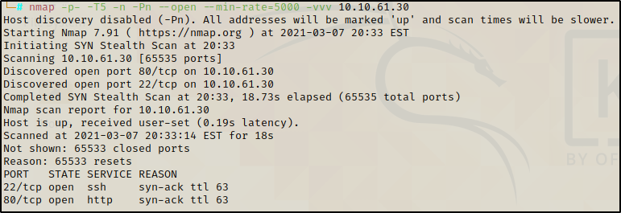

# Archangel TryHackme Walkthrough

<p align="center">
  
</p>

We begin with an nmap scan in two phases. First phase identify all ports open and then the second scan is used to identify the versions of those ports.

`nmap -p- -T4 -Pn -n --min-rate=5000 -oG Allports 10.10.179.65`



Ports 22 and 80 are open, now its time to scan versions `nmap -p22,80 -sC -sV 10.10.179.65`


Open a browser and look what is shown and we can see a standard website however there is a different hostname for support contact. Let's add this hostname in `/etc/hosts`


```
127.0.0.1       localhost
127.0.1.1       kali

# The following lines are desirable for IPv6 capable hosts
::1     localhost ip6-localhost ip6-loopback
ff02::1 ip6-allnodes
ff02::2 ip6-allrouters

#THM machines

10.10.61.30  mafialive.thm

```

Then try to navigate in the browser with the new hostname and we got the first flag.


It's time to look for hidden files or directories within the new hostname. I will use gobuster

```
gobuster dir -u http://mafialive.thm/ -w /usr/share/wordlists/dirb/common.txt -t 30

[+] Url:            http://mafialive.thm/
[+] Threads:        30
[+] Wordlist:       /usr/share/wordlists/dirb/common.txt
[+] Status codes:   200,204,301,302,307,401,403
[+] User Agent:     gobuster/3.0.1
[+] Timeout:        10s
===============================================================
2021/03/04 23:23:03 Starting gobuster
===============================================================
/.htpasswd (Status: 403)
/.htaccess (Status: 403)
/.hta (Status: 403)
/index.html (Status: 200)
/robots.txt (Status: 200)
/server-status (Status: 403)

```

robots.txt exists for this hostname, let's inspect 


Al darle clic al boton vemos que utiliza un parametro GET el cual nos podria servir para probar si existe una vulnerabilidad de LFI(Local File Inclusion)


Podemos aprovechar que esta ejecutando PHP para correr el siguiente comando que se encuentra en este articulo https://www.idontplaydarts.com/2011/02/using-php-filter-for-local-file-inclusion/


