# ColddBoxEasy TryHackme Walkthrough

![]/images/bakcground.PNG

As usual we start with nmap to know the open ports of the machine

We can use this command to accelerate the results of nmap scan

`nmap  -p- -T5 -n -Pn --open --min rate 5000 -vvv <ip-address>`

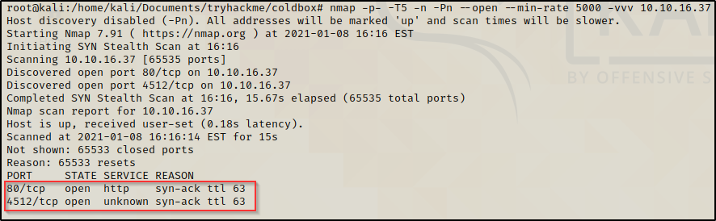

Looks like port 80 and port 4512 are opened so with this information now we can proceed to scan the services running in these ports

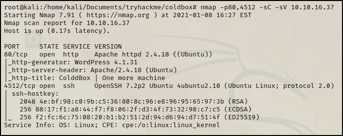

Port 80 is running Wordpress so we can run wpscan to get more information about the server

This options enumerate all the information available in the box.

`wpscan --url http://<ip/address>`

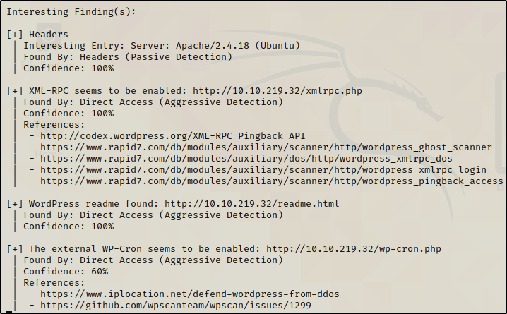

No plugins were found, but we got an outdated theme that maybe could be exploitable. Making a search in Google looks like this theme is vulnerable to DOM-based XSS https://blog.sucuri.net/2015/05/jetpack-and-twentyfifteen-vulnerable-to-dom-based-xss.html However requires some social engeneering and could be hard to exploit.

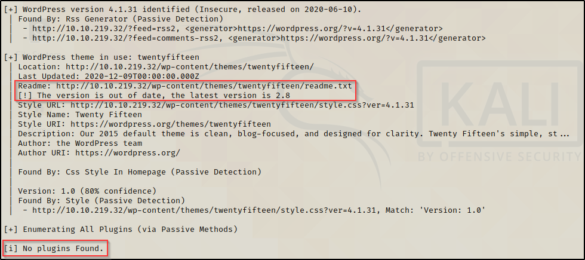

No backups files were found during the scan.

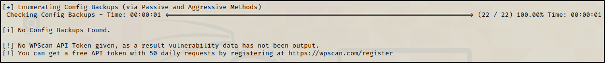

Wordpress also has an option to enumerate users, we can try to dump some information related to users using 

`wpscan --url <ip-address> --enumerate u`

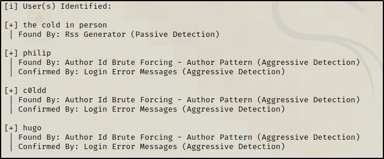

Inspecting with the URL in port 80 we can see the main page of the Wordpress site. Here we can verify that user **c0ldd** exists.

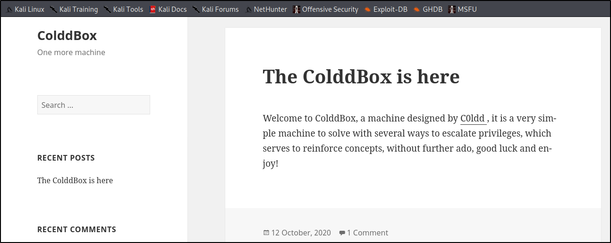

Also there is a comment from **Sr Hott** but no more information related to the machine.

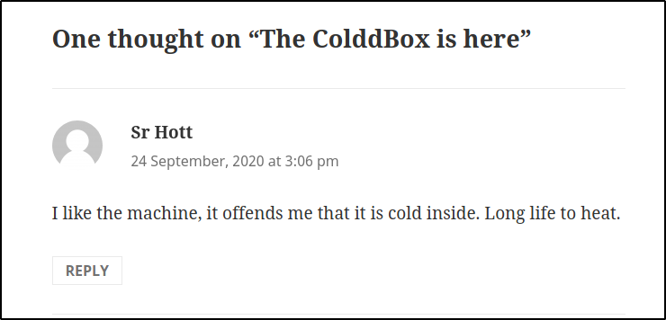

The admin panel is in `<ip-address>/wp-admin`. We can try to brute force the password with the users we got from the previous scan. For this task we can use hydra or Wpscan.
Wpscan also have an option to brute force the admin panel so we will stick with it.

`wpscan --url <ip-address> --usernames c0ldd --passwords /usr/share/wordlists/rockyou.txt`

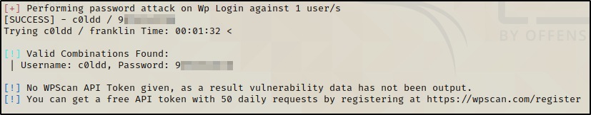

The user **c0ldd** uses a common and insecure password, with this credentials now we can access to the admin panel.

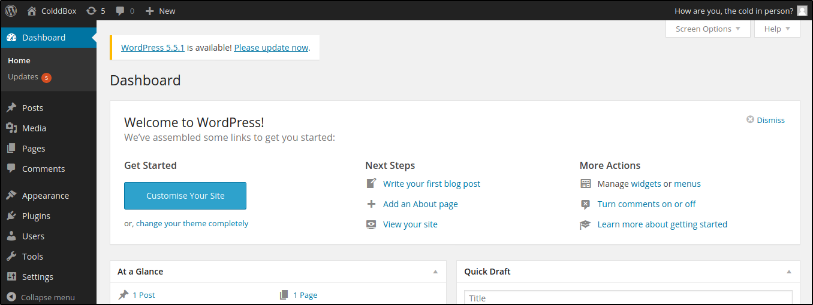

Wordpress uses PHP files with that in mind, we can setup a PHP reverse shell. The first step is to look for Appearence tab then click Editor and finally select 404.php Template.
Here we can modify the content of 404.php file and replace it with the reverse shell. 

We can copy the php-reverse-shell.php from https://raw.githubusercontent.com/pentestmonkey/php-reverse-shell/master/php-reverse-shell.php. Don't forget to modify the **IP** and **port** before saving the file.

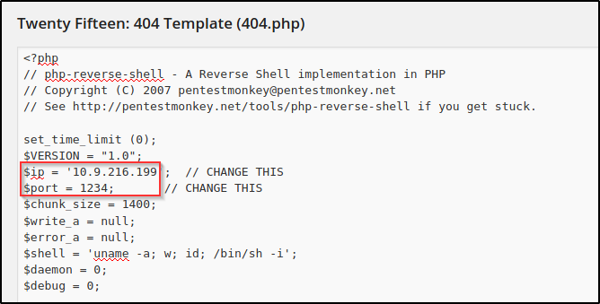

Setup a nc listener in our Kali machine

`nc -lvnp 1234`

The path of the **twenty fifteen** theme was /wp-content/themes/twentyfifteen/ in order to execute our reverse shell we must add the 404.php to the path.

`<ip-address>/wp-content/themes/twentyfifteen/404.php`

Now we got a shell. Let's upgrade with the following commands

```
python3 -c 'import pty; pty.spawn("/bin/bash")'
ctrl + Z
stty raw -echo; fg
export TERM=xterm
```

user.txt flag is in /home/c0ldd directory but we don't have permissions as user **www-data**

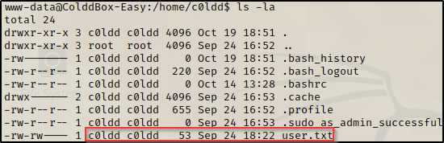

In order to obtain this flag we must sign in as user **c0ldd**. Looking in Google, https://serverpilot.io/docs/where-to-find-your-database-credentials-in-wordpress/ says that Wordpress credentials are stored in the file **wp-config.php**. This file is located in /var/www/html in our machine.

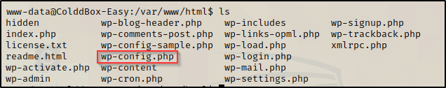

Here we obtain a password, that maybe will escalate privileges in order to login as user c0ldd due to password reuse.

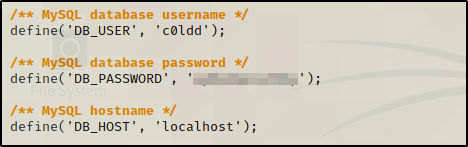

We successfully login as user **c0ldd** and now we can read the content of the **user.txt** file. The flag is base64 encoded but in the hint says that the flag is actually the encoded flag.

`user.txt   R*************************************************==`

We can use `sudo -l` to know which commands can be run with root privileges.

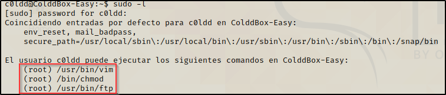

We will use vim to escalate privileges to root. Lets look  for the command vim.
